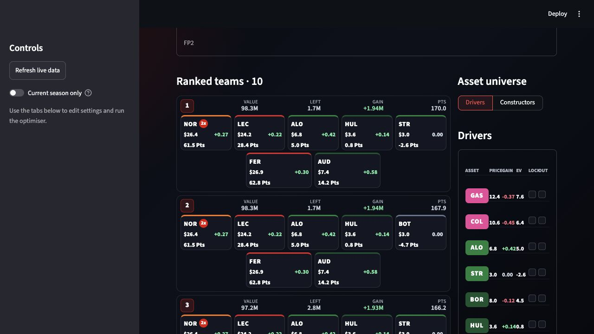
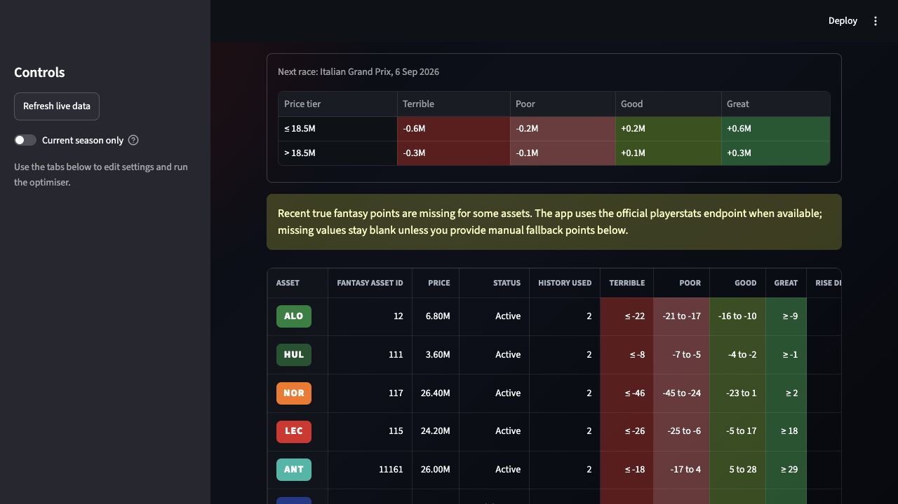
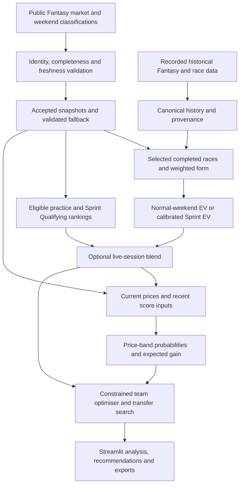

# F1 Fantasy Optimiser

A live F1 Fantasy decision-support and optimisation app. It combines current market and weekend data with historical Fantasy scores, statistical expected-points models, fitted Sprint adjustments and price-growth estimates to help build teams and plan transfers.

Public-feed validation, reproducible calibration and mixed-integer optimisation sit behind an interactive Streamlit interface.

**[Use the live app](https://f1optimise.streamlit.app/)** · [Run locally](#run-locally) · [Technical documentation](docs/README.md)

## Features

- **Live weekend intelligence:** current driver/constructor prices, event identification, session availability and explicit source/freshness diagnostics. Refresh as the weekend progresses, with validated market fallback and retention of previously accepted scoring inputs when a refresh fails.
- **Forecasting:** expected Fantasy points for drivers and constructors, completed-race selection/exclusion, recency decay and current/past-season weighting. Dedicated Sprint calibration and optional practice/Sprint Qualifying emphasis adjust next-event projections.
- **Team optimisation:** ranked five-driver, two-constructor squads under a budget, locks/exclusions, a points–price-growth trade-off, 2x driver selection, and 3x, Limitless and No Negative chip scenarios.
- **Transfer planning:** enter or upload a current team, bank and free transfers; compare moves after penalties using points, price growth, combined or risk-adjusted objectives. Inactive holdings remain identifiable without becoming selectable purchases.
- **Analysis and interface:** Market projections, price-band probabilities and score thresholds; historical points-per-million efficiency and a comparison team builder; responsive desktop/mobile views, team JSON and PNG table/team exports.



*Ranked teams from the real app, September 2026. Points and gains are model estimates.*

<details>
<summary>Market view: score thresholds for price-change bands</summary>



*The Market view translates price bands into next-event score targets. Missing historical inputs remain visible rather than being silently filled.*

</details>

## How forecasts update during a weekend

Current market prices and event identity are resolved separately from scoring history. The baseline uses selected completed races, with recency and season weighting; an unfinished weekend does not enter completed-race form. Qualifying, Sprint and race classifications, plus official Fantasy scores where available, support scoring and completion checks as results arrive.

**Practice can affect projections, but only when enabled.** The **Live session emphasis** slider defaults to **0**. Above zero, complete classifications for the forecast event provide a ranking-based adjustment: FP1/FP2/FP3 on normal weekends, or FP1/Sprint Qualifying on Sprint weekends. The model reassigns the baseline EV values by session ranking and blends that projection with baseline EV. It is a classification-based signal, not a lap-time or race-pace simulation. Missing or incomplete sessions are excluded from that blend.

Use **Refresh live data** to update available inputs. Sessions become eligible progressively after validation; source/status panels explain missing, partial or retained data. Market prices can update while previously verified scoring inputs remain in use.

## Sprint and price modelling

**Sprint weekends have a dedicated model.** Historical Sprint observations fit separate driver and constructor adjustments, including shrinkage/strength terms. Grand Prix and Sprint contributions are kept separate to prevent double counting. The active version is **`sprint_ev_2026_v2`**; updates follow **audit → candidate → validation → explicit activation**, with frozen inputs and comparison reports. The app does not refit or activate automatically. See [Sprint model maintenance](docs/SPRINT_MODEL_MAINTENANCE.md).

**Expected points and expected price gain answer different questions.** Points estimate Fantasy scoring; gain estimates a change in an asset's Fantasy price, in millions. A score-distribution model uses projected points, volatility, DNF risk and available recent scores to assign probabilities to **Terrible / Poor / Good / Great** price bands. Expected gain is the probability-weighted price movement under the model's rules and bounds.

The Market **Thresholds** view shows the next-event scores needed to reach those bands given price and available recent history. These are decision aids derived from code-configured, inferred rules—not adjustable accuracy targets or published official price algorithms. **Efficiency** compares historical points per million separately from the forecast.

The main optimiser's **Price-growth value** slider sets how many objective points +1.0M of expected gain is worth; zero emphasises points alone. Limitless uses points only. The transfer tool additionally exposes **Points only**, **Price growth only**, **Combined points + price growth** and **Risk-adjusted combined** modes. Chip multipliers affect team points, not underlying price movement.

## How it works technically



Canonical 2023–2026 recorded Fantasy history retains source provenance and missing components; inactive/replacement drivers retain their identities. Current market prices are distinct from historical event prices. Atomic refresh handling and verified snapshots guard against partial responses and event rollovers.

PuLP/CBC solves team selection as a mixed-integer problem. Shared modelling supports transfer evaluation, budgets, multipliers and value analysis. Automated tests cover ingestion failures, data integrity, model arithmetic, optimisation constraints, calibration maintenance and Streamlit interactions. See [data definitions](docs/HISTORICAL_FANTASY_SCORES_2023_2026.md) and [release/reproducibility checks](docs/REPOSITORY_RELEASE.md).

## Limitations

Public endpoints can change or return incomplete classifications; coverage varies by season, asset and session. Forecasts and price-band probabilities are estimates, without demonstrated predictive-accuracy guarantees. Price rules are inferred, the historical Sprint sample is small, and practice rankings do not capture fuel loads or race pace. Inspect source warnings before acting on recommendations.

## Run locally

Use **Python 3.11** (the tested deployment version), from the repository root:

```sh
git clone https://github.com/dnpjr/f1_fantasy_optimizer.git
cd f1_fantasy_optimizer
python -m venv .venv
```

Activate the environment:

```sh
# macOS / Linux
source .venv/bin/activate
```

```powershell
# Windows PowerShell
.venv\Scripts\Activate.ps1
```

For Windows Command Prompt, use `.venv\Scripts\activate.bat`.

```sh
python -m pip install -r requirements.txt
python -m streamlit run streamlit_app.py
```

No account credentials or API keys are required. Public feeds require internet access; reviewed offline seeds support fallback and regression tests but are dated snapshots, not a live-data guarantee. Refresh data in the app and check the displayed source status before using recommendations.

Enter a team in the UI or upload its JSON export. Personal saved configuration is optional at `data/current_team.local.json` and is ignored by Git. The public [example JSON](data/research/sprint_round_11/example_team.json) shows the schema; its historical IDs need checking against the current market.

## Development and checks

```sh
python -m pip install -r requirements-dev.txt
python -m pytest tests -q
python -m compileall -q f1fantasy scripts tests streamlit_app.py
python scripts/update_sprint_model.py --audit
```

The audit is read-only and offline by default. Future updates and activation commands are documented in the [maintenance guide](docs/SPRINT_MODEL_MAINTENANCE.md). Historical research fixtures are deliberately fixed; current-calibration tests exercise the active dataset separately.

The original CLI remains available as `python -m f1fantasy.recommend`. It is a legacy, network-using workflow with module-level settings; it does **not** have feature parity with the Streamlit Sprint/live-session pipeline or a `--help` parser. Use Streamlit for current production recommendations. Optional editable installation (`python -m pip install -e '.[dev]'`) also registers `f1fantasy-recommend` and `f1fantasy-debug`.

## Repository and deployment

| Path | Role |
| --- | --- |
| `f1fantasy/` | Ingestion, identities, modelling, optimisation and shared application logic |
| `streamlit_app.py` | Streamlit entrypoint and interface |
| `data/` | Canonical history, active/archived calibrations, reviewed cache seeds and frozen research inputs |
| `scripts/` | Explicit ingestion, research and calibration maintenance programs |
| `tests/` | Unit, data-integrity, optimisation and UI regression tests |
| `docs/`, `reports/` | Developer guides, source provenance and retained modelling evidence |

Streamlit Community Cloud should use **`streamlit_app.py`**, the reviewed release branch, **Python 3.11**, and root `requirements.txt`. Commit the required data and calibration artifacts with the code; they are intentionally part of the source checkout. See [deployment and artifact policy](docs/REPOSITORY_RELEASE.md) for clean-checkout checks and release procedure.

## Sources and licence

Code is [MIT licensed](LICENSE). Historical source files retain their own attribution/licences; see the [data guide](data/README.md) and [canonical history documentation](docs/HISTORICAL_FANTASY_SCORES_2023_2026.md). The project licence does not grant rights to third-party data, imagery or trademarks.

Unofficial project; not affiliated with Formula 1, the FIA, Formula One Management or the official Fantasy game.
