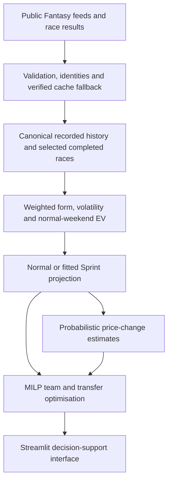

# F1 Fantasy Optimiser

An end-to-end decision-support app for F1 Fantasy: public data ingestion, validated race history, expected-value and price-change models, and mixed-integer team optimisation in a Streamlit interface.

**[Use the live app](https://f1optimise.streamlit.app/)** · [Run locally](#run-locally) · [Technical documentation](docs/README.md)

## What the app does

- **Build teams:** compare legal five-driver, two-constructor squads under a budget; lock or exclude assets and optimise for points, price growth, or a combined objective.
- **Plan transfers:** enter or import your current team, bank and free transfers; compare gains after transfer penalties and retain inactive holdings without making them selectable purchases.
- **Compare assets:** inspect expected points, historical points per million, price-change bands and probabilistic price-gain estimates. Choose completed races and adjust recency/history weighting.
- **Explore race scenarios:** model normal and Sprint weekends, with 3x, Limitless and No Negative chip handling. Chip multipliers affect team points, not underlying price movement.
- **Use on desktop or mobile:** persistent team/transfer views, downloadable results and explicit source/freshness diagnostics.


<details>
<summary>Price-threshold analysis screenshot</summary>


</details>

*Real app captures, September 2026; displayed values are model estimates.*

## How it works technically



**Data engineering.** Market prices are resolved separately from historical event prices. Feed validation, atomic refreshes, last-good snapshots and season/round identities prevent a partial response or race rollover from silently replacing accepted data. Recorded 2023–2026 Fantasy history retains provenance and missing components; inactive/replacement drivers retain their historical identities.

**Statistical modelling.** Selected race history combines current and past seasons with configurable recency weighting. Sprint EV uses separately fitted driver and constructor adjustments, including shrinkage/strength terms. Sprint points are removed from the normal baseline before the Sprint contribution is added. Optional live-session emphasis is guarded by event identity and completion checks; its default weight is zero.

**Reproducible calibration.** The active Sprint model is `sprint_ev_2026_v2`. Its parameters are fitted from completed historical Sprint weekends and maintained through **audit → candidate → validation → explicit activation**. Frozen inputs, versioned artifacts and comparison reports make changes reviewable. See [Sprint model maintenance](docs/SPRINT_MODEL_MAINTENANCE.md); the app never fits or activates a model automatically.

**Optimisation.** PuLP/CBC solves the constrained team selection problem. Shared modelling feeds points and price-growth objectives, current-team valuation, transfer limits/penalties, locks, exclusions and chip scenarios. Tests cover source failures, model arithmetic, constraints, maintenance safety and Streamlit interactions.

These are modelling estimates, not demonstrated guarantees of predictive accuracy. Price-change rules are inferred and configurable; limited Sprint samples, missing data and changing public endpoints remain practical limitations.

## Run locally

Use **Python 3.11** (the tested deployment version), from the repository root:

```sh
git clone https://github.com/dnpjr/f1_fantasy_optimizer.git
cd f1_fantasy_optimizer
python -m venv .venv
```

Activate the environment:

```sh
# macOS / Linux
source .venv/bin/activate
```

```powershell
# Windows PowerShell
.venv\Scripts\Activate.ps1
```

For Windows Command Prompt, use `.venv\Scripts\activate.bat`.

```sh
python -m pip install -r requirements.txt
python -m streamlit run streamlit_app.py
```

No account credentials or API keys are required. Public feeds require internet access; reviewed offline seeds support fallback and regression tests but are dated snapshots, not a live-data guarantee. Refresh data in the app and check the displayed source status before using recommendations.

Enter a team in the UI or upload its JSON export. Personal saved configuration is optional at `data/current_team.local.json` and is ignored by Git. The public [example JSON](data/research/sprint_round_11/example_team.json) shows the schema; its historical IDs need checking against the current market.

## Development and checks

```sh
python -m pip install -r requirements-dev.txt
python -m pytest tests -q
python -m compileall -q f1fantasy scripts tests streamlit_app.py
python scripts/update_sprint_model.py --audit
```

The audit is read-only and offline by default. Future updates and activation commands are documented in the [maintenance guide](docs/SPRINT_MODEL_MAINTENANCE.md). Historical research fixtures are deliberately fixed; current-calibration tests exercise the active dataset separately.

The original CLI remains available as `python -m f1fantasy.recommend`. It is a legacy, network-using workflow with module-level settings; it does **not** have feature parity with the Streamlit Sprint/live-session pipeline or a `--help` parser. Use Streamlit for current production recommendations. Optional editable installation (`python -m pip install -e '.[dev]'`) also registers `f1fantasy-recommend` and `f1fantasy-debug`.

## Repository and deployment

| Path | Role |
| --- | --- |
| `f1fantasy/` | Ingestion, identities, modelling, optimisation and shared application logic |
| `streamlit_app.py` | Streamlit entrypoint and interface |
| `data/` | Canonical history, active/archived calibrations, reviewed cache seeds and frozen research inputs |
| `scripts/` | Explicit ingestion, research and calibration maintenance programs |
| `tests/` | Unit, data-integrity, optimisation and UI regression tests |
| `docs/`, `reports/` | Developer guides, source provenance and retained modelling evidence |

Streamlit Community Cloud should use **`streamlit_app.py`**, the reviewed release branch, **Python 3.11**, and root `requirements.txt`. Commit the required data and calibration artifacts with the code; they are intentionally part of the source checkout. See [deployment and artifact policy](docs/REPOSITORY_RELEASE.md) for clean-checkout checks and release procedure.

## Sources and licence

Code is [MIT licensed](LICENSE). Historical source files retain their own attribution/licences; see the [data guide](data/README.md) and [canonical history documentation](docs/HISTORICAL_FANTASY_SCORES_2023_2026.md). The project licence does not grant rights to third-party data, imagery or trademarks.

Unofficial project; not affiliated with Formula 1, the FIA, Formula One Management or the official Fantasy game.
